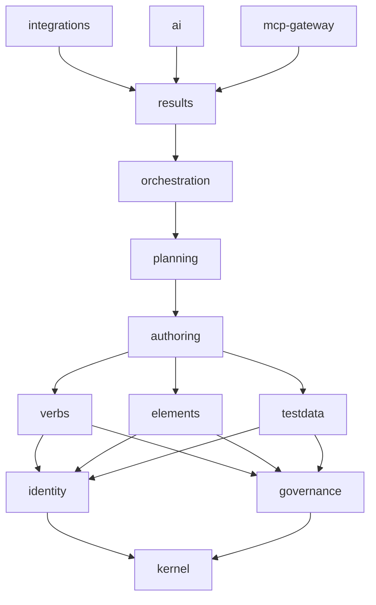

# Bản đồ cấu trúc dự án TestKite

## 1. Cách đọc bản đồ

Bản đồ này trả lời đúng một câu hỏi: **"code chỗ nào, thuộc về ai, được gọi ai?"** — nó
KHÔNG kể tiến độ (xem [`../tasks/README.md`](../tasks/README.md)) và KHÔNG thay blueprint
(xem [`../../docs/SYSTEM_DESIGN.md`](../../docs/SYSTEM_DESIGN.md) — *tại sao* hệ thống được
thiết kế như vậy). Đọc theo thứ tự: §2 để thấy hình dạng DAG, §3 để tra một module cụ thể,
§4 cho mọi thứ ngoài `apps/core`, §5 để biết cổng CI nào chứng minh điều gì.

Ba **nguồn sự thật máy đọc** — bản đồ chép lại chúng, không định nghĩa lại:

| Nguồn | Nói gì | Ai cưỡng chế |
|---|---|---|
| [`../module-dag.json`](../module-dag.json) | module nào được import module nào | `eslint-plugin-boundaries` (qua `eslint.config.mjs`) + [`../tools/module-dag.test.ts`](../tools/module-dag.test.ts) |
| [`../ownership.json`](../ownership.json) | prefix bảng DB thuộc về module nào | review + `tools/module-dag.test.ts` (đồng bộ key với DAG) |
| [`../eslint.config.mjs`](../eslint.config.mjs) | luật kiến trúc dạng lint (DAG, compiler PURE, queue chỉ trong kernel, runner zero-credential, chỉ 1 file chạm browser driver) | `pnpm lint` + [`../tools/lint-rules.test.ts`](../tools/lint-rules.test.ts) |

**Bản đồ này có gate: [`../tools/project-map.test.ts`](../tools/project-map.test.ts) đỏ khi mốc.**
Thêm một thư mục dưới `apps/core/src/modules/`, thêm một key vào `module-dag.json`, sửa tay
khối mermaid, hay gỡ liên kết từ `README.md` sang đây — cả bốn đều làm `pnpm run test:tools` đỏ.

## 2. DAG 13 module

Khối dưới đây **được SINH từ `module-dag.json`**, không vẽ tay: hàm `mermaidFromDag()` export
từ `tools/project-map.test.ts` sinh lại nó mỗi lần chạy test và so từng ký tự với khối đang
nằm ở đây.

**Luật rút gọn (transitive reduction).** `module-dag.json` liệt kê allow-list ĐẦY ĐỦ — `results`
ghi cả chín module dưới nó — vì `eslint-plugin-boundaries` cần từng đích được nêu tên. Vẽ y
nguyên là 71 cạnh trên 13 nút: một bức hình không ai đọc nổi, tức là không có hình. Nên hình
dưới chỉ giữ **cạnh trực tiếp tối thiểu**: cạnh `A --> B` bị bỏ khi A còn một đích trực tiếp
khác đã với tới được B. Cạnh bị bỏ VẪN được phép — cứ đi theo mũi tên là ra. Mỗi mũi tên đọc
là **"A được phép import B"**; chiều ngược lại và chiều ngang không có ngoại lệ, đi bằng domain
event qua `krn_outbox`.

> Node id `mcp_gateway` là bản làm sạch của `mcp-gateway`: dấu gạch ngang trong id làm mermaid
> đọc nhầm thành token cạnh, nên tên thật nằm ở nhãn.

## 3. Mười ba module trong `apps/core/src/modules/`

Đọc mỗi khối: **trách nhiệm · bảng sở hữu · được import · file chính · facade export ·
milestone/trạng thái · test**. Ba trạng thái: **thật** (có logic chạy được), **nửa** (mới có
phần tối thiểu cho module dưới nó dùng), **placeholder** (chỉ `index.ts` khai `MODULE`, chờ
milestone ghi kèm).

> **Quy ước heading — gate đọc đúng khuôn này.** Một module là heading `### <tên module>` ĐỨNG
> MỘT MÌNH, không thêm chữ nào. Heading `###` khác trong tài liệu (§4 trở đi) bắt buộc kèm phần
> mô tả, nếu không `tools/project-map.test.ts` đọc nó thành "module ma" và báo đỏ.

Ngoài thư mục test riêng của từng module, sáu suite **cắt ngang** phủ mọi module:
`apps/core/test/arch/` (ranh giới + adapter guard), `test/schema/` (RLS, tenancy, composite FK,
role separation), `test/isolation/` (T4 — cách ly tenant, không thương lượng),
`test/concurrency/` (12 file, chỉ chạy trên Postgres 17 thật), `test/http/` (shell layer),
`test/harness/` (đồ nghề: PGlite, mock-IdP, realpg mode).

---

### kernel

- **Trách nhiệm:** nền của mọi module — kết nối DB, ngữ cảnh tenant (RLS), vai DB, outbox giao dịch, env đã parse.
- **Bảng sở hữu:** `krn_`, `sec_`
- **Được import:** (không gì cả — kernel là gốc DAG)
- **File chính:** `db/{client,repo,role-separation,rows,schema,tenant,types}.ts`, `env.ts`, `outbox/{writer,relay}.ts` — 11 file src, 1 test cạnh file (`env.test.ts`)
- **Facade export (`index.ts`):** `MODULE` · `withTenant`, `withAuthRole`, `withDispatchRole` · `APP_ROLE`/`appRole`, `AUTH_ROLE`/`authRole`, `DISPATCH_ROLE`/`dispatchRole`, `RELAY_ROLE`/`relayRole` · `TESTKITE_SUB_ROLES`, `roleSeparationViolations` + `RoleSeparationViolation`, `RoleSeparationViolationKind` · `MissingTenantContextError`, `TenantRepo`, `assertTenantContext` · `createDb` + `DbHandle` · `TenantContext`, `TkDb`, `TkTx` · `firstRow`, `isSqlRow`, `rowsOf` + `SqlRow` · `loadEnv`, `parseEnv`, `envSchema` + `KernelEnv` · `enqueueOutbox` + `OutboxEvent` · `runRelayOnce` + `OutboxRecord`, `Publisher`, `RelayOptions`, `RelayResult`
- **Milestone/trạng thái:** M1 — **thật**
- **Test:** `apps/core/test/kernel/` (4 file: outbox writer/relay, pool error, tenant)

### identity

- **Trách nhiệm:** org → team → project, người dùng, membership, RBAC, API token, OIDC — mọi câu hỏi "ai đang gọi và được làm gì".
- **Bảng sở hữu:** `organizations`, `teams`, `projects`, `deleted_teams`, `users`, `memberships`, `team_invites`, `idn_`, `api_tokens`, `mcp_clients`, `oauth_grants`, `element_proposals`
- **Được import:** `kernel`
- **File chính:** `auth/{authenticator,issue,login,password,token}.ts`, `rbac/{authorize,cache,permissions}.ts`, `oidc/connector.ts`, `db/schema.ts`, `routes.ts`, `onboarding.ts`, `audit-port.ts` — 14 file src, 6 test cạnh file
- **Facade export (`index.ts`):** `MODULE` · `hashPassword`, `verifyPassword`, `needsRehash`, `passwordPolicy`, `PASSWORD_MIN_LENGTH` · bảng `users`, `memberships`, `teams`, `organizations`, `projects`, `apiTokens` + enum `membershipRole`, `userStatus`, `apiTokenKind` · `mintTokenSecret`, `hashTokenSecret`, `parseTokenSecret`, `expiryFromDays`, `MAX_TOKEN_TTL_DAYS` + `MintedToken` · `PERMISSIONS`, `ROLE_PERMISSIONS`, `NEVER_GRANTABLE`, `HIGH_RISK`, `isPermission`, `isNeverGrantable`, `isHighRisk` + `Permission`, `MembershipRole` · `authorize`, `assertGrantable`, `effectiveScopes` + `CredentialKind` · `createAuthenticator` + `AuthenticatedPrincipal`, `Authenticator`, `AuthenticatorDeps` · `createAuthzCache`, `AUTHZ_CACHE_TTL_MS` + `AuthzCache`, `CachedGrant` · `issueApiToken`, `revokeApiToken` + `IssueTokenInput`, `MintedApiToken` · `loginWithPassword`, `SESSION_TTL_DAYS`, `LOGIN_FAILED_MESSAGE` + `DeferPort`, `LoginDeps`, `LoginResult` · `provisionTeamCore` + `ProvisionTeamInput`, `TeamCore` · type `AuditEvent`, `AuditEventActorKind`, `AuditEventSeverity`, `AuditPort`
- **Milestone/trạng thái:** M2 — **thật**
- **Test:** `apps/core/test/identity/` (6 file: api-tokens, login, members, oidc, token-routes, users-schema)

### governance

- **Trách nhiệm:** audit event (partition + retention) và quota — chỗ duy nhất một run được đặt chỗ và được hoàn.
- **Bảng sở hữu:** `quota_limits`, `gov_`, `usage_counters`, `usage_ledger`, `audit_events`
- **Được import:** `kernel`
- **File chính:** `audit/write.ts`, `quota.ts`, `db/{schema,audit-schema,usage-schema}.ts`, `routes.ts`, `onboarding.ts` — 8 file src
- **Facade export (`index.ts`):** `MODULE` · `writeAuditEvent`, `AUDIT_RETENTION_DAYS`, `ensureAuditPartitionsSql` + `AuditEventInput`, `AuditSeverity`, `AuditActorKind` · bảng `auditEvents`, `quotaLimits`, `usageCounters` · `seedQuotaDefaults` · `reserveRunSlot`, `refundRunSlot`, `QUOTA_METRIC_RUNS_PER_DAY` + `ReserveResult`
- **Milestone/trạng thái:** M2 (audit) + M3 (quota run-slot) — **thật**; metering/fair-share/lane đầy đủ thuộc M5
- **Test:** `apps/core/test/governance/` (4 file: audit-partition, audit-routes, audit-write, quota)

### verbs

- **Trách nhiệm:** catalog verb NLP và ánh xạ verb → `op_key` của registry (`@testkite/verb-kit`).
- **Bảng sở hữu:** `action_catalog`, `vrb_`, `team_action_overlay`
- **Được import:** `kernel`, `identity`, `governance`
- **File chính:** chỉ `index.ts`
- **Facade export (`index.ts`):** placeholder, chỉ `index.ts` — export duy nhất `MODULE`
- **Milestone/trạng thái:** **placeholder (M4)**
- **Test:** chưa có (`apps/core/test/verbs/` chưa tồn tại)

### elements

- **Trách nhiệm:** screen, element, LocatorSet và usage — nguồn locator cho compiler phase 4.
- **Bảng sở hữu:** `elm_`
- **Được import:** `kernel`, `identity`, `governance`
- **File chính:** chỉ `index.ts`
- **Facade export (`index.ts`):** placeholder, chỉ `index.ts` — export duy nhất `MODULE`
- **Milestone/trạng thái:** **placeholder (M4)**
- **Test:** chưa có

### testdata

- **Trách nhiệm:** profile dữ liệu test, row, hàm sinh dữ liệu — nguồn cho fan-out data-driven ở compiler phase 2/5.
- **Bảng sở hữu:** `tdt_`
- **Được import:** `kernel`, `identity`, `governance`
- **File chính:** chỉ `index.ts`
- **Facade export (`index.ts`):** placeholder, chỉ `index.ts` — export duy nhất `MODULE`
- **Milestone/trạng thái:** **placeholder (M4)**
- **Test:** chưa có

### authoring

- **Trách nhiệm:** test case và step — soạn, sửa có version/ETag, revision, review 4 mắt, và **snapshot** mà compiler nhận vào.
- **Bảng sở hữu:** `aut_`, `published_step_groups`, `published_step_group_versions`, `step_group_subscriptions`
- **Được import:** `kernel`, `identity`, `governance`, `verbs`, `elements`, `testdata`
- **File chính:** `case-service.ts`, `review-service.ts`, `snapshot.ts`, `concurrency.ts`, `steps-flatten.ts`, `errors.ts`, `revision/{canonical,codec,diff,payload}.ts`, `db/{case-repo,review-repo,revision-repo,schema}.ts`, `routes/{cases,context}.ts` — 17 file src, 4 test cạnh file
- **Facade export (`index.ts`):** `MODULE` · `createCase`, `replaceSteps`, `toCaseSummary` + `Actor` · `decideReview`, `promoteCase`, `submitForReview`, `withdrawReview` + `CaseMutationInput`, `DecideReviewInput` · `buildCompileSnapshot`, `revisionPayloadToAuthoredCase`, `MAX_SNAPSHOT_CASES` + `SnapshotDeps`, `SnapshotInput`, `SnapshotPin` · `formatETag`, `parseIfMatch` · `CaseNotFoundError`, `CaseStateError`, `FourEyesViolationError`, `IfMatchRequiredError`, `VersionConflictError` · `authoringRoutes` · `getAuth`, `requireScope`, `InsufficientScopeError` + `RequestAuth`, `ScopedDescriptor`
- **Milestone/trạng thái:** M2 — **thật**
- **Test:** `apps/core/test/authoring/` (9 file) + `test/concurrency/{case-edit-race,promote-lock,review-state-race}.test.ts`

### planning

- **Trách nhiệm:** suite, plan, run target, environment, schedule — "chạy CÁI GÌ, Ở ĐÂU, KHI NÀO".
- **Bảng sở hữu:** `pln_`
- **Được import:** `kernel`, `identity`, `governance`, `verbs`, `elements`, `testdata`, `authoring`
- **File chính:** `environment.ts`, `onboarding.ts`, `db/schema.ts` — 4 file src
- **Facade export (`index.ts`):** `MODULE` · `plnEnvironments`, `plnEnvStatus` · `seedEnvironmentStubs`, `ONBOARD_ENV_NAMES` · `loadRunEnvironment`, `EnvironmentNotFoundError`
- **Milestone/trạng thái:** M2/M3 — **nửa**: mới có environment stub + seed onboarding, đủ để orchestration phase 0 nạp env. Suite/plan/run target/schedule thuộc **M4**
- **Test:** `apps/core/test/planning/environment-stubs.test.ts` (1 file)

### orchestration

- **Trách nhiệm:** vòng đời một run — hàng đợi (`job_runs` trên Postgres `FOR UPDATE SKIP LOCKED`), lease + epoch, dispatcher, token của worker, event và SSE.
- **Bảng sở hữu:** `orc_`, `job_runs`, `egress_policies`, `migration_state`, `migration_parallel_runs`
- **Được import:** `kernel`, `identity`, `governance`, `verbs`, `elements`, `testdata`, `authoring`, `planning`
- **File chính:** `run-service.ts`, `run-token.ts`, `events.ts`, `sse.ts`, `routes.ts`, `onboarding.ts`, `queue/{job-queue,reaper}.ts`, `dispatcher/{lease,loop}.ts`, `db/{schema,run-schema,job-schema,fleet-schema}.ts` — 15 file src
- **Facade export (`index.ts`):** `MODULE` · `egressPolicies`, `egressMode`, `seedEgressObserve`, `EGRESS_OBSERVE_DAYS` · bảng `orcRuns`, `orcRunPlans`, `orcCompileDiagnostics`, `jobRuns`, `orcDispatcherLease`, `orcWorkers`, `orcRunTokens`, `orcRunEvents` + enum `runLane`, `runStatus`, `runVerdict`, `runPin` · `mintRunToken`, `verifyRunToken`, `renewRunTokenTtl`, `revokeRunTokensFor`, `registerWorker`, `verifyWorkerToken`, `touchWorker`, `RUN_TOKEN_TTL_SLACK_SECONDS`, `WORKER_TOKEN_TTL_HOURS` + `RunTokenScope`, `WorkerTokenScope` · `RUN_EVENT_KINDS`, `readRunEvents`, `recordRunEvent` + `RecordEventInput`, `RunEventKind`, `StoredRunEvent` · `claimJobs`, `completeJob`, `dispatchPending`, `fenceJob`, `heartbeatJob`, `jobExistsForTeam`, `LEASE_SECONDS`, `MAX_INFRA_ATTEMPTS` + `ClaimedJobRow`, `EpochOutcome`, `FencedJob`, `JobLane` · `abortRun`, `isRunTerminal`, `loadRunStatus`, `readRunPlan`, `startRun`, `jobCost`, `JOB_COST_MAX` + `FrozenRunPlan`, `StartRunInput`, `StartRunDeps`, `StartRunResult` · `orchestrationRoutes` + `OrchestrationRoutesDeps` · `startDispatcher` + `DispatcherHooks`, `TickResult` · `activeRunStreamCount`, `SSE_HEARTBEAT_MS`, `SSE_POLL_MS` + `IntervalHandle`, `RunStreamDeps`
- **Milestone/trạng thái:** M3 — **thật**
- **Test:** `apps/core/test/orchestration/` (16 file) + `test/concurrency/{claim-storm,dispatcher-leader,job-claim-race,lease-epoch-race,run-event-ordinal-race}.test.ts`
- **Ghi chú:** hàng đợi **không** phải BullMQ. `bullmq`/`ioredis` không còn là dependency ở bất kỳ `package.json` nào trong workspace; `eslint.config.mjs` vẫn giữ luật cấm import chúng ngoài `kernel` như một cái phanh chống tái phát.

### results

- **Trách nhiệm:** verdict của case/step, artifact (presign S3, control plane không chạm byte), advisory signal, tổng hợp run.
- **Bảng sở hữu:** `res_`
- **Được import:** `kernel`, `identity`, `governance`, `verbs`, `elements`, `testdata`, `authoring`, `planning`, `orchestration`
- **File chính:** `results-service.ts`, `artifacts.ts`, `s3/presign.ts`, `db/{results-schema,artifact-schema}.ts` — 6 file src
- **Facade export (`index.ts`):** `MODULE` · `writeCaseResults`, `latestCaseResults`, `readStepResults`, `ensureResultPartitionsSql`, `RESULT_RETENTION_DAYS`, `STEP_VERDICTS` + `CaseResultInput`, `StepResultInput`, `CaseResultRow`, `StepResultRow`, `CaseVerdict`, `StepVerdict`, `WriteCaseResultsOutcome` · bảng `resCaseResults`, `resCaseResultKeys`, `resStepResults`, `resArtifacts` + `RESULT_VERDICTS`, `ResultVerdict`, `ARTIFACT_STATUSES`, `ArtifactStatus` · `ARTIFACT_KINDS`, `ARTIFACT_MAX_BYTES`, `ARTIFACT_URL_TTL_SECONDS`, `createArtifactUpload`, `markArtifactsUploaded` + `ArtifactKind`, `ArtifactUploadSlot`, `CreateArtifactUploadInput`, `S3Config`
- **Milestone/trạng thái:** M3 — **thật**
- **Test:** `apps/core/test/results/` (6 file) + `test/concurrency/result-attempt-race.test.ts`

### integrations

- **Trách nhiệm:** webhook ra ngoài, delivery, ánh xạ định danh hệ ngoài (module **rìa** — không module lõi nào được import nó).
- **Bảng sở hữu:** `itg_`
- **Được import:** mọi module lõi (`kernel` … `results`)
- **File chính:** chỉ `index.ts`
- **Facade export (`index.ts`):** placeholder, chỉ `index.ts` — export duy nhất `MODULE`
- **Milestone/trạng thái:** **placeholder (M6)**
- **Test:** chưa có

### ai

- **Trách nhiệm:** sinh DRAFT (case, locator) kèm ngân sách + audit — AI không bao giờ ghi thẳng, người promote (module **rìa**).
- **Bảng sở hữu:** `ai_`
- **Được import:** mọi module lõi (`kernel` … `results`)
- **File chính:** chỉ `index.ts`
- **Facade export (`index.ts`):** placeholder, chỉ `index.ts` — export duy nhất `MODULE`
- **Milestone/trạng thái:** **placeholder (M5)**
- **Test:** chưa có

### mcp-gateway

- **Trách nhiệm:** mặt phẳng MCP cho agent (list/get/search, draft_case, trigger_run, get_run_status, get_failure_report, element:propose) — đi chung `authorize()` của identity (module **rìa**).
- **Bảng sở hữu:** **không sở hữu bảng nào** (`ownership.json` để mảng rỗng) — mọi truy cập đi qua facade của module khác
- **Được import:** mọi module lõi (`kernel` … `results`)
- **File chính:** chỉ `index.ts`
- **Facade export (`index.ts`):** placeholder, chỉ `index.ts` — export duy nhất `MODULE`
- **Milestone/trạng thái:** **placeholder (M5)**
- **Test:** chưa có

## 4. Ngoài `apps/core/src/modules/`

### `apps/core` — phần vỏ (shell)

Không nằm trong DAG module, vì đây là nơi *lắp ráp* chúng:
`src/composition-root.ts` (dựng dependency, khởi động dispatcher), `src/main.ts`,
`src/http/{app,auth,errors,log-serializers,shutdown,types}.ts`,
`src/http/internal/{app,routes,claim-rate-limit}.ts` (mặt phẳng fleet — Fastify RIÊNG, cổng
riêng), `src/http/usecases/onboard-team.ts`. Migration Drizzle: `apps/core/drizzle/` (45 file
`.sql`, sinh bằng `pnpm db:generate`, CI có gate chống drift). Test: `apps/core/test/http/`,
`test/arch/`.

### `apps/runner` — fleet worker (nơi DUY NHẤT có browser)

- `src/worker.ts` — vòng lặp claim job từ control plane rồi chạy chain.
- `src/browser/` — `engine.ts` là **port** `BrowserEngine`; `playwright-engine.ts` là file
  **duy nhất trong toàn repo** được import driver browser (`eslint.config.mjs` khoá theo đúng
  đường dẫn đó); `fake-engine.ts` là engine giả cho mọi test không cần chromium.
- `src/executor/` — `run-chain.ts`, `step-runner.ts`, `timeouts.ts`, `verdict.ts`.
- `src/memory/` + `src/memory-governance.ts` — 4 tầng trần bộ nhớ: `rss.ts`, `limiter.ts`,
  `shedder.ts`, `recycler.ts`, `context-monitor.ts`, `oom-score.ts`, `oom-reporter.ts`, `errno.ts`.
- `src/artifacts/` — `screenshot-ring.ts`, `uploader.ts` (PUT thẳng lên S3 bằng URL đã ký).
- `src/runnerd/` — daemon phía host: `daemon.ts`, `main.ts`, `psi.ts`.
- `src/control-plane-client.ts`, `src/config.ts`, `src/quarantine.ts`.
- `deploy/` — unit systemd + `runner-manifest.json` (mỗi lane khai `memoryMb`, `swap:false`).

**Ranh giới fake vs thật.** Mọi thứ TRÊN `BrowserEngine` test được với 0 chromium
(`fake-engine`); chromium thật chỉ xuất hiện ở `test/browser/playwright-engine.test.ts`,
`test/host/**` và `test/soak/**` — ba tập KHÔNG chạy trong lần chạy mặc định (`test/host` bị
`vitest.config.ts` loại trừ, chỉ nhận lại khi `TESTKITE_HOST_CGROUP=1`; soak cần
`TESTKITE_SOAK=1`) và chỉ được nghiệm thu ở job CI `fleet-soak` trên runner non-root.

**Zero-credential.** Runner không có credential DB và không import `@testkite/core` hay bất kỳ
driver DB nào — lint chặn cả `import` tĩnh lẫn `await import()`. Nó chỉ nói chuyện với control
plane qua `src/control-plane-client.ts` bằng run token/worker token có scope theo run.

### `apps/ui` — vỏ giao diện

**Placeholder.** Đúng ba file: `package.json`, `tsconfig.json`, `src/main.tsx`. Chưa có test,
chưa có step-builder.

### `packages/contract` — hợp đồng API

zod là **NGUỒN** hợp đồng; `openapi.json` (đã commit) chỉ là ĐẦU RA của `pnpm openapi:gen`.
`src/schemas/` (case, step, element, run, authoring, field-map), `src/routes/`
(identity, authoring, orchestration, `internal.ts`), `src/errors.ts`, `src/enums.ts`,
`src/openapi{,.gen}.ts`. `/internal/fleet` **cố ý KHÔNG** nằm trong mảng `ROUTES` nên không
bao giờ được sinh vào `openapi.json` — CI grep byte đã commit để giữ điều đó.

### `packages/run-compiler` — trái tim, hàm thuần

Hàm **PURE**: `(scope, snapshot authoring) → RunPlan bất biến, content-hashed`. Cấm fs/net/db,
cấm `Date.now()`/`Math.random()` (lint + `tools/lint-rules.test.ts`); `node:crypto` được phép
vì phase 7 băm SHA-256.

**7 phase (1→7) nằm trong 5 file** — phase 0 và 7.5→9 thuộc orchestration, không thuộc gói này:

| Phase | Việc | File |
|---|---|---|
| 1 | resolve chuỗi prereq, check cycle, ghim revision | `phase1-chains.ts` |
| 2 | nở cấu trúc: inline step group ≤5, if/loop → cây, fan-out data-driven | `phase2-expand.ts` |
| 3 | bind verb → op registry (GOM mọi lỗi, không dừng ở lỗi đầu) | `phase3-bind.ts` |
| 4 + 5 | element → LocatorSet; merge data/env, secret giữ nguyên dạng `$secret:<name>` | `phase45-resolve.ts` |
| 6 + 7 | stamp policy/tenant; freeze: canonicalize → SHA-256 → `planFormatVersion` | `phase67-freeze.ts` |

Golden test: `src/golden.test.ts` trên **62 file** trong `fixtures/` (mỗi `CompileErrorCode`
có một fixture âm; cùng input ⇒ cùng `contentHash`). `fixtures/` cố ý NẰM NGOÀI cổng ngôn ngữ —
đó là DỮ LIỆU test và tên case tiếng Việt đi thẳng vào golden hash.

### `packages/verb-kit` — op registry

Op registry thay cho `Class.forName` của Testsigma: verb là DATA, op là CODE, compiler bind ở
compile-time. Một file `src/index.ts`: `registerVerb`, `getVerb`, `allVerbs`, `validateArgs`,
kiểu `VerbDefinition`/`OpContext`/`OpResult`. **Hai lần gọi `registerVerb`** — `web.click` và
`web.enter` (55,7% số step sản xuất), CẢ HAI op còn `throw new Error("TODO(M4): ...")` ở thân
hàm: chưa op nào chạy được. 35 verb theo census sản xuất là mục tiêu **M4**, không phải hiện trạng.

### `tools/` — test chạy từ gốc workspace (`pnpm run test:tools`)

| File | Chứng minh gì |
|---|---|
| `lint-rules.test.ts` | luật trong `eslint.config.mjs` VẪN bắt được vi phạm — gọi ESLint Node API trên `lint-fixtures/` (28 file cố ý vi phạm, `pnpm lint` không đụng tới) |
| `module-dag.test.ts` | `module-dag.json` và `ownership.json` cùng tập key, đúng 13 module, không cycle, module rìa không bao giờ là đích của module lõi |
| `field-map-inventory.test.ts` | mọi bảng `satisfies FieldMap<…>` trong workspace đều có người canh (quét cả 2 app — thứ test trong 1 app không làm được) |
| `project-map.test.ts` | **chính tài liệu này** không mốc so với đĩa + `module-dag.json` + `README.md` |

### `scripts/`, `docs/`, `tasks/`

- `scripts/test-pg.sh` (bật/tắt Postgres 17 tạm cho test), `scripts/verify-units.sh` (đọc
  *output* của `systemd-analyze verify`, vì lệnh đó trả exit 0 cả khi không parse nổi directive),
  `scripts/grant-db-roles.sql`.
- `testkite/docs/` — runbook vận hành: `runbook-db-roles.md`, và bản đồ này.
- `testkite/tasks/` — backlog M1→M9, `open-questions.md`, `REVIEW-2026-09-02.md`, và
  `tasks/plans/` (plan implement từng hạng mục). **Tiến độ chỉ nằm ở
  [`../tasks/README.md`](../tasks/README.md)** — bản đồ này cố ý không chép lại, vì hai nơi ghi
  tiến độ thì nơi thứ hai luôn là nơi lạc hậu.

## 5. Cổng máy (CI)

Đọc từ [`.github/workflows/testkite-ci.yml`](../../.github/workflows/testkite-ci.yml).
Job `build-and-test` và `db-tests` chạy mọi push/PR chạm `testkite/**` (trừ `tasks/`, `docs/`);
job `fleet-soak` chỉ chạy theo `schedule` hoặc `workflow_dispatch`.

| Cổng | Chứng minh gì | Lệnh / file |
|---|---|---|
| Typecheck | TS strict trên toàn workspace | `pnpm typecheck` |
| Test | toàn bộ suite + `test:tools` | `pnpm test` |
| OpenAPI drift | `openapi.json` đúng bằng thứ zod sinh ra | `pnpm openapi:check` |
| `/internal` không lọt | mặt phẳng fleet không nằm trong spec công khai | `grep '"/internal' packages/contract/openapi.json` |
| Kiến trúc | DAG, compiler PURE, queue chỉ trong kernel, runner zero-credential | `pnpm lint` |
| Luật lint còn bắt được | fixture vi phạm vẫn bị bắt (cổng không rỗng) | `pnpm run test:tools` |
| Không phụ thuộc vòng | madge, `skipTypeImports` | `pnpm lint:cycles` |
| Browser ngoài API image | `apps/core` không import/khai báo driver browser; có **negative control** đòi pattern bắt đúng 3/3 dạng xấu | grep trong workflow |
| Browser chỉ ở runner | không package chia sẻ nào kéo browser vào; và `apps/runner` **không được mất** `playwright-core` | grep + `package.json` |
| Trần bộ nhớ | mỗi lane trong `runner-manifest.json` có `memoryMb` và `swap:false` | `node -e` đọc thẳng JSON |
| Cú pháp unit systemd | unit PARSE được (systemd ÁP DỤNG được là bằng chứng host pilot, CI không boot fleet) | `scripts/verify-units.sh` |
| Ngôn ngữ | 0 ký tự tiếng Việt trong `apps/*/src`, `apps/*/test`, `apps/runner/deploy`, `packages/*/src`, `tools`, `scripts`, config gốc | grep trong workflow |
| Cách ly tenant L3 | token team B + id team A ⇒ 404 (T4, không thương lượng) | `pnpm --filter @testkite/core test test/isolation/` |
| Không hard-code secret | không có token `tk_…` thật ngoài test | grep |
| Never-grantable khớp blueprint | 5 permission cấm cấp có mặt cả ở code lẫn `SYSTEM_DESIGN.md` §3 | grep hai phía |
| Audit dependency prod | không advisory ≥ moderate chạm dependency runtime | `pnpm audit --prod --audit-level=moderate` |
| Postgres 17 thật | tranh chấp khoá/lease/outbox — PGlite (1 connection) KHÔNG chứng minh được | job `db-tests`, `TESTKITE_REQUIRE_PG=1` |
| Migration drift | schema đổi mà quên `db:generate` | job `db-tests`, `if: always()` |
| Host shape + soak | sandbox chromium (chỉ đo được khi uid ≠ 0), 200 chain synthetic chống OOM tái sinh | job `fleet-soak` |

**Giới hạn thành thật của gate bản đồ.** Workflow loại `testkite/docs/**` khỏi trigger, nên một
commit CHỈ sửa `docs/PROJECT_MAP.md` không chạy CI. Chiều nguy hiểm vẫn được canh: thêm/xoá
module hay sửa `module-dag.json` là commit code ⇒ CI chạy ⇒ `project-map.test.ts` đỏ ngay.
Chiều còn lại (sửa hỏng bản đồ trong một commit thuần docs) bị bắt ở lần push code kế tiếp.

## 6. Điểm lệch có chủ ý: "12 module" vs 13 key

[`../../docs/SYSTEM_DESIGN.md`](../../docs/SYSTEM_DESIGN.md) §4 mở đầu bằng **"12 module DAG một
chiều"**, còn `module-dag.json` và `ownership.json` đều có **13 key**, và trên đĩa cũng đúng 13
thư mục dưới `apps/core/src/modules/`.

Không phải lỗi số học, mà là **cách đếm khác nhau**: câu tiếp ngay sau trong chính §4 liệt kê
`kernel → identity, governance → verbs | elements | testdata → authoring → planning →
orchestration → results` (10 module lõi) rồi `edge: integrations, ai, mcp` (3 module rìa) — tổng
13. `mcp-gateway` là **module rìa**: nó không sở hữu bảng nào, không module lõi nào được import
nó, và nó là mặt phẳng giao thức chứ không phải một miền nghiệp vụ mới. Blueprint gọi tên nhóm
kiến trúc là "12 module"; `module-dag.json` phải liệt kê từng thư mục có thật để lint có luật mà
áp — nên nó có 13.

**Quy ước:** "12 module" là một CÁI TÊN, không phải một phép đếm.
[`../tools/module-dag.test.ts`](../tools/module-dag.test.ts) chốt cứng số THẬT
(`toHaveLength(13)`) làm dây bẫy, và blueprint **không bị sửa** — đổi câu chữ của blueprint để
khớp một con số là sửa nhầm đầu: con số đã có test canh, còn câu chữ là lịch sử quyết định.
